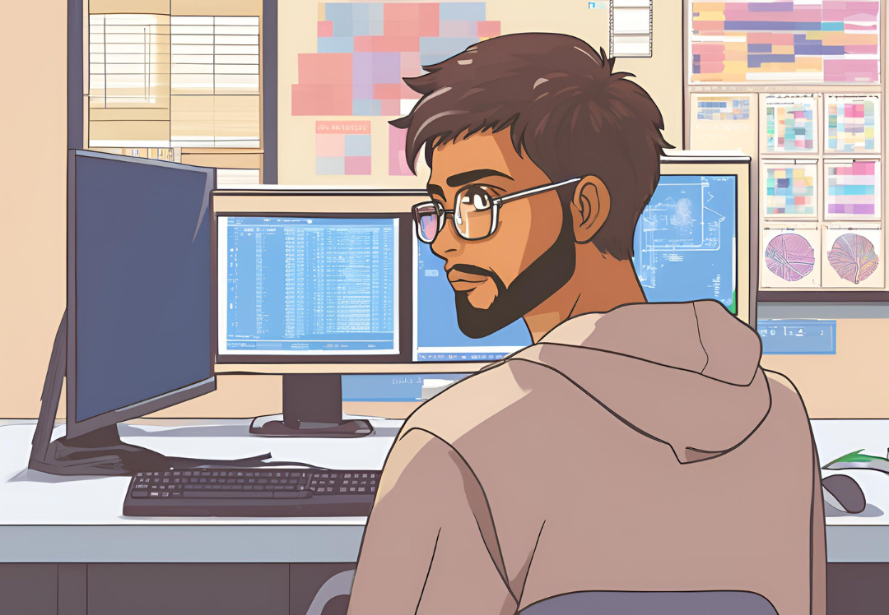

---

## ✦ ✦ ✦ 📫 Get in Touch ✦ ✦ ✦
 

&nbsp; &nbsp; &nbsp;

 
<h3>
  📧 Email:
  <code>mrakheen10@gmail.com</code>
</h3>

---

 
⭐️ From <strong><a href="https://github.com/Mrakheen">Mrakheen</a></strong>

